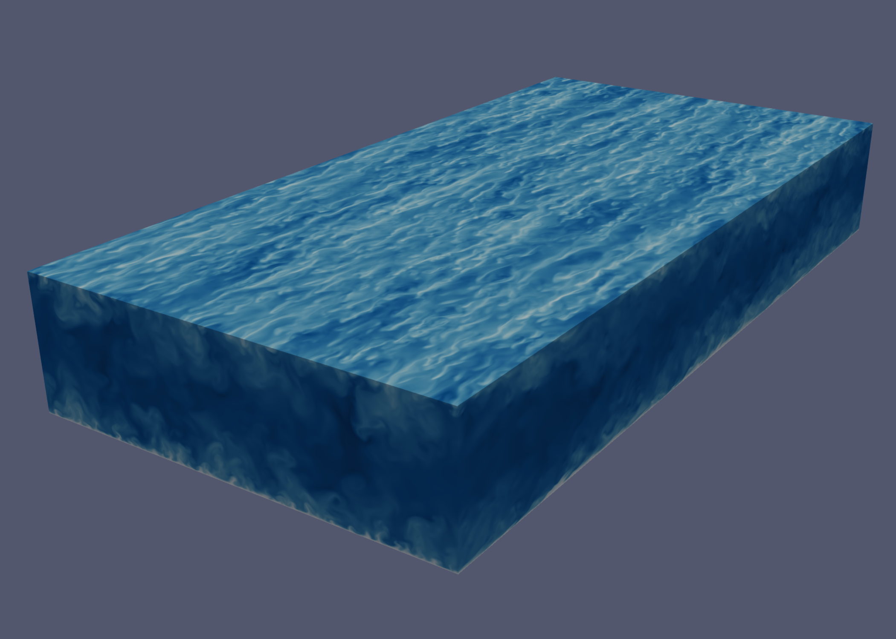

# Open-3D-WallTurbulence
- DNS solver for wall turbulence
- Fourier spectral in horizontal plane and compact difference (up to 8th order) in wall-normal direction
- Multi-step time integration
- Implicit scheme for viscous term
- X-Z pencil MPI parallel strategy
- Load toml config file

# Future work
- [ ] upload testing cases of $Re_\tau=180$ turbulent channel flow
- [ ] update functions including continued calculation
- [ ] update passive or active scalar equations
- [ ] update rotating forcing
- [ ] update free-slip wall and moving-wall boundary conditions

